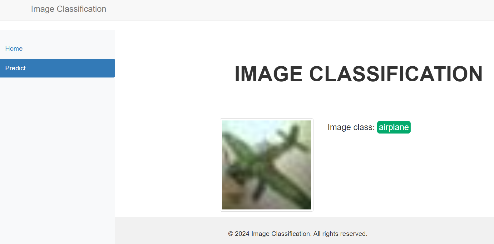
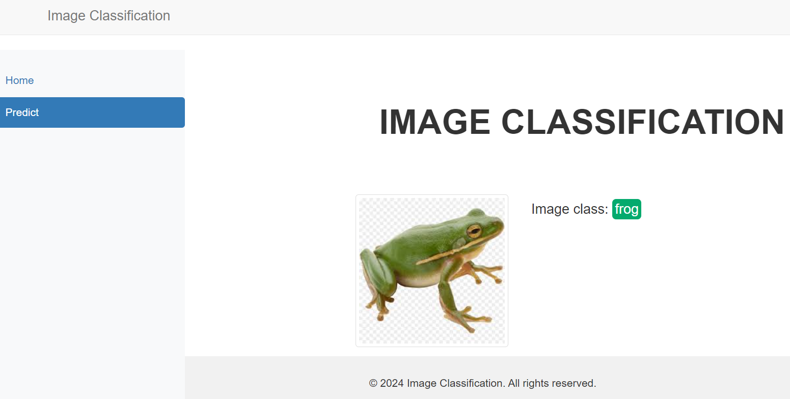
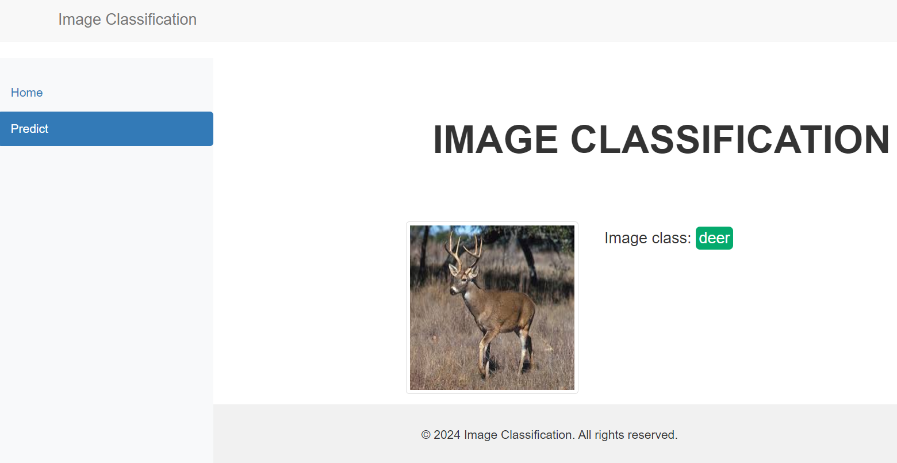

# Image classification of CIFAR10 dataset.

Using Flask to deploy our best model for the classification on [CIFAR10 dataset](https://www.tensorflow.org/api_docs/python/tf/keras/datasets/cifar10/load_data) 


## Installation
### Steps
1. Clone this repository and unzip all the files
2. Create virtual environment and activate it

```
python -m venv venv
```
```
. venv/Scripts/activate
```

3. Install requirements using pip

```
$ pip install -r requirements.txt
```
4. Run the application
- Navigate to main.py
```
cd app
```
- Execute the flask app
```
python main.py
```
5. Interact with the application

When the application starts, interact with it at the below

```
http://127.0.0.1:5000
```
6. Interface for uploading image


6. Interface for predicting image class


7. Sample tests with real life images


