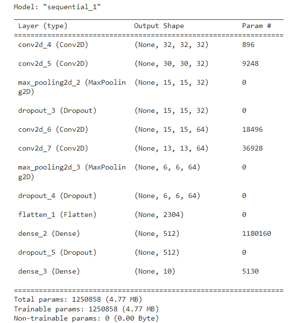
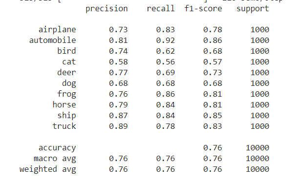

# Report

## Data pre-processing
In summary of this project, we can note that:

- CIFAR10 dataset requires a lot of pre-processing for optimal results
    - The images are very blurred in nature and to mitigate this, brightness and contrast of images was done.

    - Other pre-processing involved normalization of images

Sample images before adjusting brightness and contrast

Sample images after adjusting brightness and contrast

## Building model
Different models were experimented:
- CNN based model (baseline model)
- ResNet50 model (transfer learning)
- VGG16 model (transfer learning)
- DenseNet121 model (transfer learning)
- InceptionResNetV2 model (transfer learning) - model requires input shape with values 75px by 75px, our data is 32px by 32px.

Of these models, the best performining model was the baseline model which was later improved adding regularization techniques (dropout layers), and callbacks.
The model architecture is summarized below.

## Evaluation of best model
The best model was evaluated based on precision, recall, F1-score and accuracy on the test data. These results are summarized below

